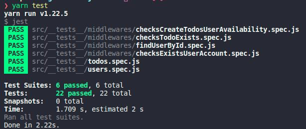

	

	<h1>Working with middlewares</h1>

### Summary

- [About the challenge](#about-the-challenge)

- [Tests](#Tests)

### About the challenge

- An application to create users and manage todos, but focusing on middlewares to handle the data. [Click here](https://github.com/felipejsborges/ignite-nodejs-02/commit/6310e44ff0ca216aa3e34bbb80d74afa596adc45) to see the implementation.

### Tests

- **`Should be able to find user by username in header and pass it to request.user`**

- **`Should not be able to find a non existing user by username in header`**

- **`Should be able to let user create a new todo when is in free plan and have less than ten todos`**

- **`Should not be able to let user create a new todo when is not Pro and already have ten todos`**

- **`Should be able to let user create infinite new todos when is in Pro plan`**

- **`Should be able to put user and todo in request when both exits`**

- **`Should not be able to put user and todo in request when user does not exists`**

- **`Should not be able to put user and todo in request when todo id is not uuid`**

- **`Should not be able to put user and todo in request when todo does not exists`**

- **`Should be able to find user by id route param and pass it to request.user`**

- **`Should not be able to pass user to request.user when it does not exists`**

 

	
	

by Felipe Borges 
[LinkedIn](https://www.linkedin.com/in/felipejsborges) | [GitHub](https://github.com/felipejsborges)
